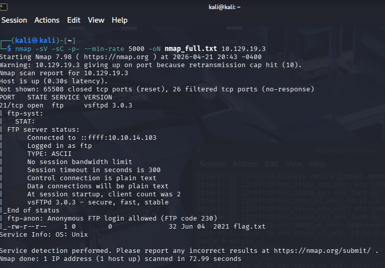
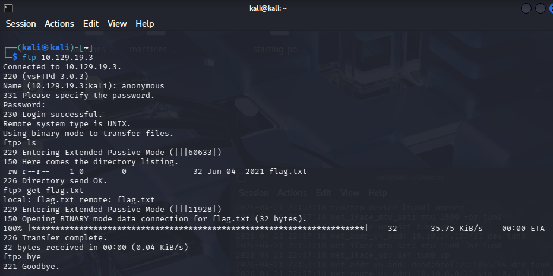
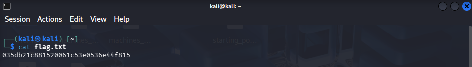

# Fawn

**OS:** Linux | **Dificuldade:** Very Easy | **Data:** 21/04/2026

## Resumo

Fawn foi uma máquina classificada como **Very Easy** que demonstrou riscos de configurações inseguras em serviços FTP. A exploração foi direta: identificação de um serviço FTP exposto com login anônimo habilitado, permitindo acesso aos arquivos sem autenticação.

**Principais pontos:**
- Serviço FTP (porta 21) exposto com login anônimo habilitado
- Arquivo `flag.txt` acessível publicamente sem autenticação
- Falha de configuração básica que expõe arquivos sensíveis

## Reconhecimento

### Scan Nmap

```bash
nmap -sV -sC -p- --min-rate 5000 -oN nmap_full.txt 10.129.19.3
```

**Resultado:**

```
PORT   STATE SERVICE VERSION
21/tcp open  ftp     vsftpd 3.0.3
| ftp-anon: Anonymous FTP login allowed (FTP code 230)
|_-rw-r--r--    1 0        0              32 Jun 04  2021 flag.txt
Service Info: OS: Unix
```



O scan revelou apenas uma porta aberta: **21/tcp** rodando FTP (vsftpd 3.0.3), com login anônimo habilitado e o arquivo `flag.txt` listado diretamente.

## Enumeração

Com o serviço FTP identificado, foi testado o acesso anônimo:

```bash
ftp 10.129.19.3
# Name: anonymous
# Password: <vazio>
```

Durante a enumeração, descobriu-se que:
- O login anônimo estava habilitado sem restrições
- O arquivo `flag.txt` estava listado no diretório raiz do FTP
- O servidor negocia **Extended Passive Mode (EPSV)** automaticamente
- O cliente FTP alternou para **modo binário** para a transferência

## Exploração

### Acesso Inicial

O acesso ao servidor FTP foi obtido via login anônimo:

```bash
ftp 10.129.19.3
# Name: anonymous
# Password: <vazio>
```

### Coleta da Flag

Após o login, o arquivo foi baixado e lido localmente:

```bash
ftp> ls                  # lista flag.txt (32 bytes, Jun 04 2021)
ftp> get flag.txt        # download via EPSV; 32 bytes recebidos em 00:00
ftp> bye                 # 221 Goodbye.
$ cat flag.txt
```





## Escalação de Privilégios

N/A

## Flags

- **Flag:** `035db21c881520061c53e0536e44f815`

## Lições Aprendidas

### Impacto no Mundo Real

1. **Login anônimo FTP é perigoso**
   - FTP anônimo permite que qualquer pessoa acesse os arquivos sem credenciais
   - Deve ser desabilitado em ambientes de produção
   - Se necessário, restringir a um diretório isolado sem arquivos sensíveis

2. **FTP transmite dados em texto claro**
   - Credenciais e arquivos trafegam sem criptografia
   - Deve ser substituído por SFTP ou FTPS sempre que possível

3. **Defesas Recomendadas**
   - Desabilitar login anônimo (`anonymous_enable=NO` no vsftpd.conf)
   - Restringir acesso FTP via firewall
   - Migrar para SFTP/SCP para transferência segura de arquivos
   - Auditar permissões de arquivos expostos em serviços de rede

### Comandos Úteis

```bash
# Scan nmap com scripts e detecção de versão
nmap -sV -sC -p- --min-rate 5000 -oN nmap_full.txt 10.129.19.3
```

```bash
# Conexão FTP anônima
ftp 10.129.19.3
```

```bash
# Comandos FTP úteis
ls          # listar arquivos
get flag.txt  # baixar arquivo
bye         # encerrar sessão
```
