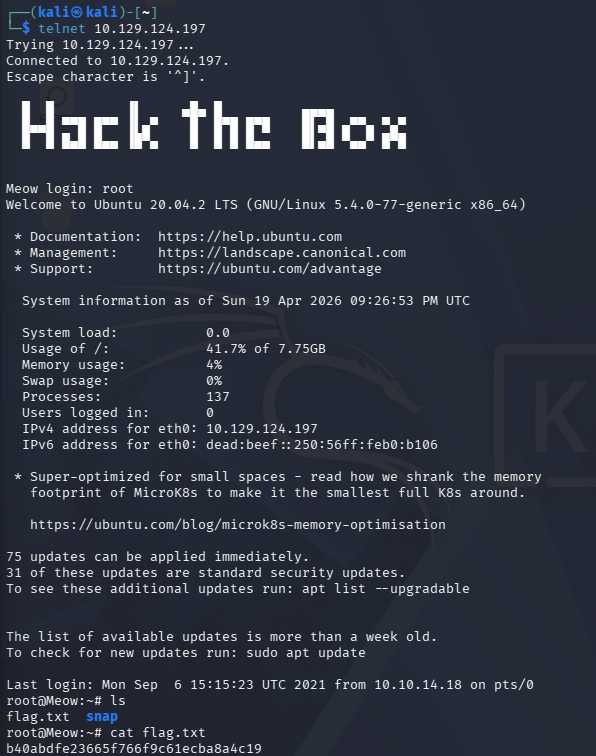

# Meow

**OS:** Linux | **Dificuldade:** Very Easy | **Data:** 03/04/2026

## Resumo

Meow foi uma máquina classificada como **Very Easy** que demonstrou riscos críticos de configurações inseguras em serviços de rede. A exploração foi direta: identificação de um serviço Telnet exposto e acesso root sem autenticação.

**Principais pontos:**
- Serviço Telnet (porta 23) exposto sem exigência de autenticação forte
- Conta root acessível sem senha definida
- Falha de configuração básica que permite acesso total ao sistema

## Reconhecimento

### Scan Nmap

```bash
nmap -sV -sC -p- --min-rate 5000 10.129.124.197
```

**Resultado:**

```
PORT   STATE SERVICE VERSION
23/tcp open  telnet  Linux telnetd
Service Info: OS: Linux; CPE: cpe:/o:linux:linux_kernel
```


O scan revelou apenas uma porta aberta: **23/tcp** rodando Telnet.

## Enumeração

Com o serviço Telnet identificado, foi testado o acesso direto ao serviço:

```bash
telnet 10.129.124.197 23
```

Durante a enumeração, descobriu-se que:
- O serviço Telnet estava aceitando conexões
- A conta **root** não possuía senha definida
- Foi possível fazer login diretamente como root sem autenticação

## Exploração

### Acesso Inicial

O acesso à máquina foi obtido diretamente como root através do Telnet:

```bash
telnet 10.129.124.197 23
# Login: root
# Password: <vazio>
```



### Coleta da Flag

Após o login, a flag foi localizada e lida diretamente:

```bash
cat flag.txt
```


## Escalação de Privilégios

N/A

## Flags

- **Flag:** `HTB{b40abdfe23665f766f9c61ecba8a4c19}`

## Lições Aprendidas

### Impacto no Mundo Real

1. **Telnet é um protocolo inseguro**
   - Telnet transmite todos os dados em texto claro, incluindo credenciais
   - Deve ser substituído por SSH sempre que possível
   - Se o uso for inevitável, restringir acesso via firewall e usar autenticação forte

2. **Contas sem senha são críticas**
   - Contas privilegiadas (root) devem sempre exigir autenticação
   - Implementar políticas de senha forte e bloqueio de contas vazias
   - Usar autenticação multifator quando disponível

3. **Defesas Recomendadas**
   - Desabilitar serviços legados como Telnet
   - Implementar controle de acesso baseado em rede (firewalls, VLANs)
   - Auditar configurações de contas periodicamente
   - Usar ferramentas como `chkpasswd` para identificar contas sem senha

### Comandos Úteis


```bash
#comando nmap para descoberta de portas
nmap -sV -sC -p- --min-rate 5000 -oN nmap_full.txt 10.129.124.197
```

# Conexão Telnet
```bash
#conexão na porta vulnerável
telnet 10.129.124.197
```
